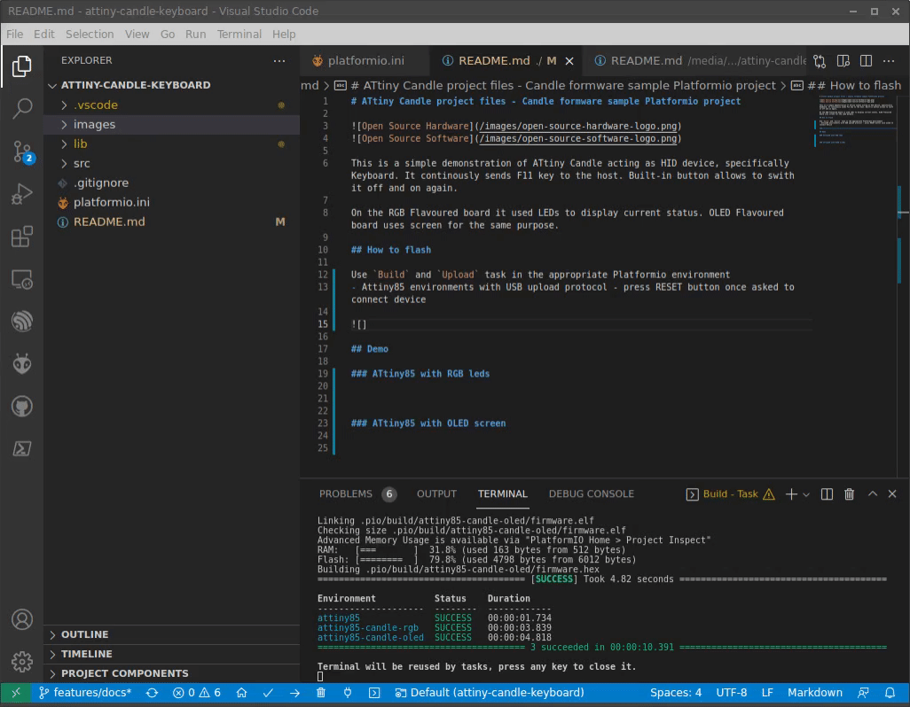

# ATtiny Candle project files - Candle formware sample Platformio project

This is a simple demonstration of ATtiny Candle acting as HID device, specifically Keyboard. It continously sends F11 key to the host. Built-in button allows to swith it off and on again.

On the RGB Flavoured board it used LEDs to display current status. OLED Flavoured board uses screen for the same purpose.

## How to flash

Use `Build` and `Upload` task in the appropriate Platformio environment
- Attiny85 environments with USB upload protocol - press RESET button once asked to connect device

## Demo

### ATtiny85 with RGB leds

### ATtiny85 with OLED screen

