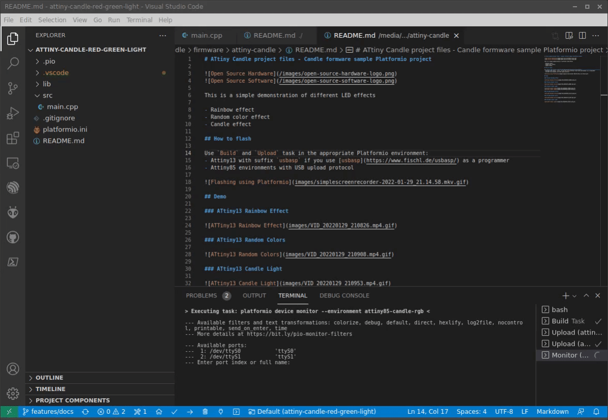

# ATtiny Candle project files - Candle formware sample Platformio project

This is a simple demonstration of ATtiny Candle acting as Green-Red traffic light for child game. It will change color randomly every 5 seconds and blink 2 seconds before change.

## How to flash

Use `Build` and `Upload` task in the appropriate Platformio environment:
- Attiny13 with suffix `usbasp` if you use [usbasp](https://www.fischl.de/usbasp/) as a programmer
- Attiny85 environments with USB upload protocol

## Demo

### ATtiny13 Go-No-Go game

### ATtiny85 Go-No-Go game

