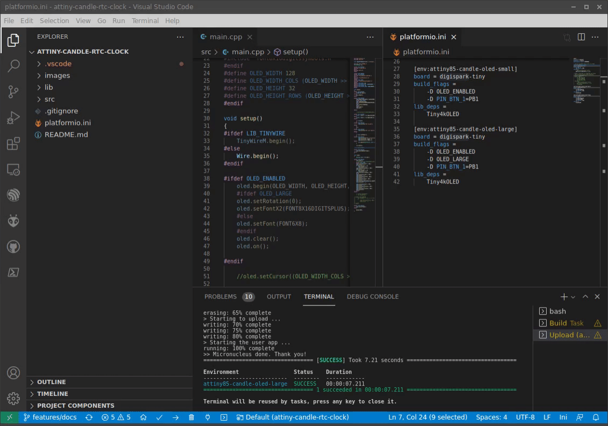

# ATtiny Candle project files - Candle formware sample Platformio project

This is a simple demonstration of ATtiny Candle acting as Digital clock. It uses onboard RTC clock chip to keep the time right. During the first flashing it will flash correct time into the board.

## How to flash

Use `Build` and `Upload` task in the appropriate Platformio environment
- Attiny85 environments with USB upload protocol - press RESET button once asked to connect device

## Demo

### ATtiny85 Clock with OLED screen

