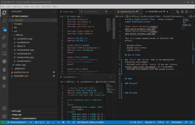
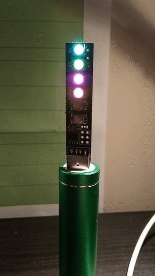

# ATtiny Candle project files - Candle formware sample Platformio project

This is a simple demonstration of different LED effects

- Rainbow effect
- Random color effect
- Candle effect

## How to flash

Use `Build` and `Upload` task in the appropriate Platformio environment:
- Attiny13 with suffix `usbasp` if you use [usbasp](https://www.fischl.de/usbasp/) as a programmer
- Attiny85 environments with USB upload protocol

## Demo

### ATtiny13 Rainbow Effect

### ATtiny13 Random Colors

### ATtiny13 Candle Light

### ATtiny85 Rainbow Effect

### ATtiny85 Random Colors

### ATtiny85 Candle Light

