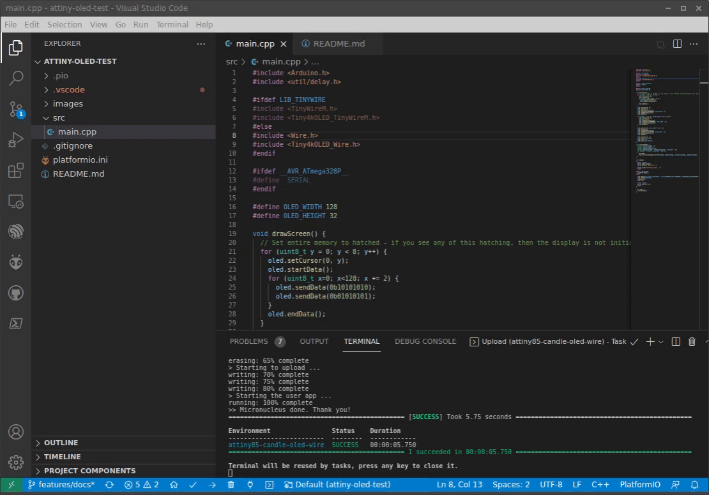

# ATtiny Candle project files - Candle formware sample Platformio project

This is a simple demonstration of ATtiny Candle using OLEd screen. Two build options demonstrate same effect using built-in Wire library and slightly less reliable but smaller memory footprint TinyWire library.

## How to flash

Use `Build` and `Upload` task in the appropriate Platformio environment
- Attiny85 environments with USB upload protocol - press RESET button once asked to connect device

## Demo

### ATtiny85 Clock with OLED screen

